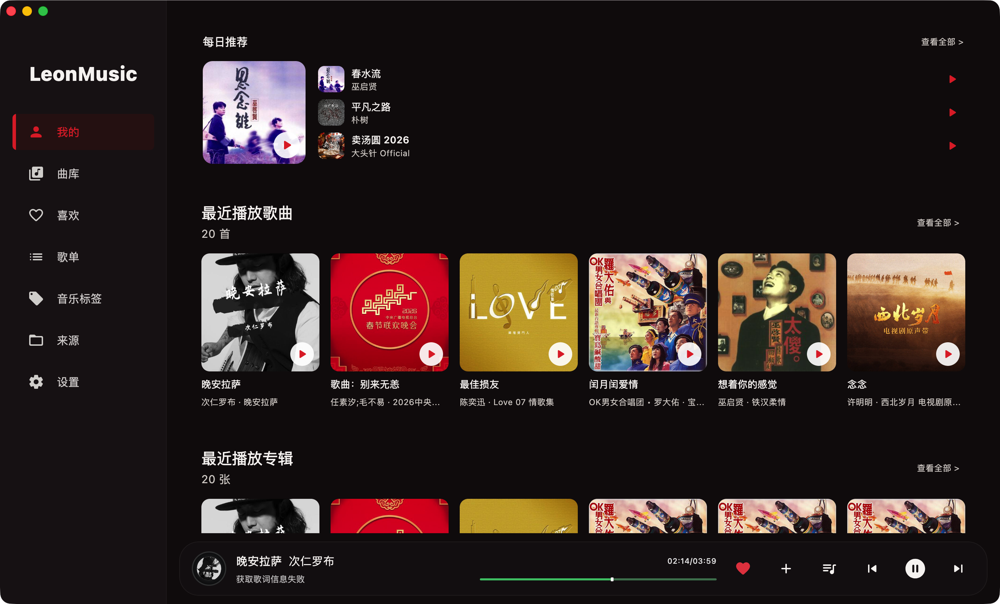
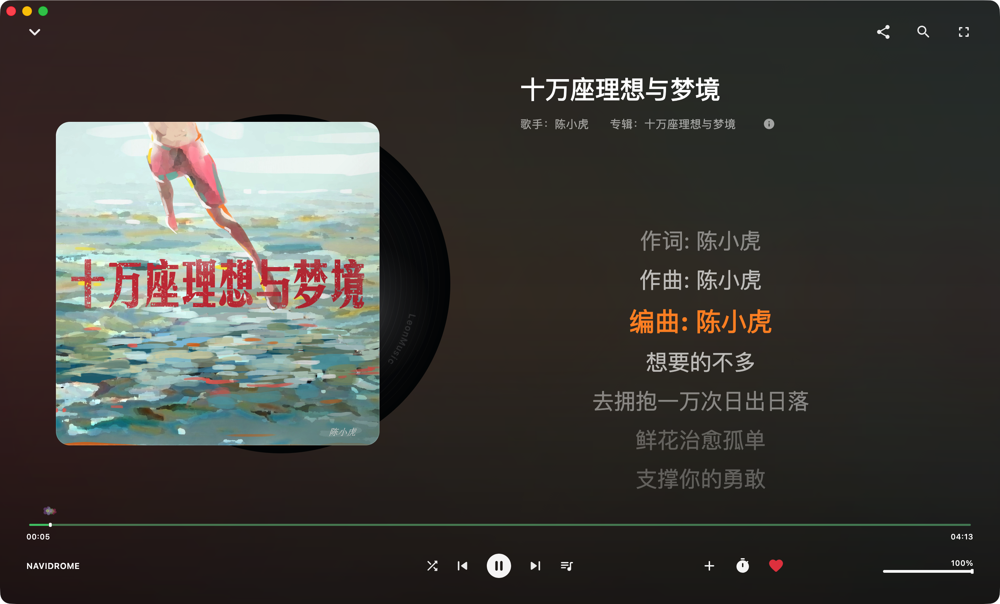
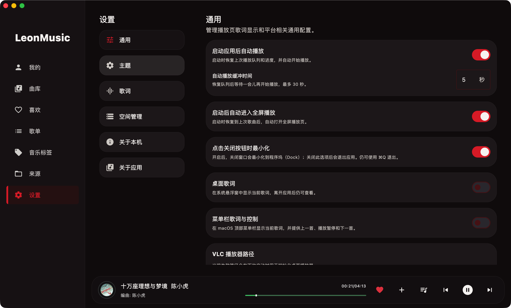
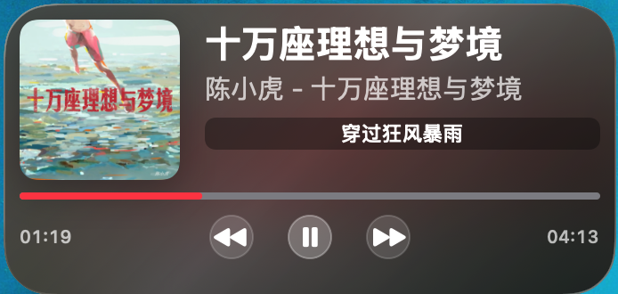

# LeonMusic

LeonMusic 根据https://github.com/wesley666/LynMusic 项目修改而来，是一款使用 Kotlin Multiplatform 构建的跨平台音乐播放器，面向本地音乐收藏、NAS 与自建音乐服务场景。它将桌面、手机、电视和车机上的听歌体验放在同一套应用与曲库工作流中。
在原项目的基础上增加了macOS桌面小组件，及播放缓存进度显示，优化了若干问题。


## 下载

最新版本与安装包请前往 [GitHub Releases](https://github.com/leon0576/LeonMusic/releases)。当前提供：

- macOS：DMG 安装包与 ZIP 压缩包
- Android 车机：通用 APK
- Android TV：通用 APK

Android 安装包为侧载版本；请在设备的安全设置中允许相应的安装来源。iOS、Windows 与 Linux 可从源码构建或直接运行开发版本。

## 核心功能

- 本地文件夹曲库：扫描、浏览与播放个人音乐收藏
- 多种音乐来源：支持本地目录、Samba、WebDAV、Navidrome 等来源
- 曲库管理：歌曲、专辑、艺人、喜欢、歌单与播放队列
- 歌词体验：歌词搜索、回填、分享与显示样式定制
- 音乐资料维护：编辑标题、歌手、专辑、歌词与封面等标签信息
- 多端适配：针对桌面、手机、Android TV、车机提供对应的交互体验
- 主题与界面：支持个性化主题设置

> 服务器地址、用户名、密码和 API Key 由应用在设备本地保存，不会随本项目源码或 GitHub Release 一起上传。建议优先使用 Navidrome 作为跨设备音乐库的统一服务。

## 支持的平台

| 平台 | 状态 |
| --- | --- |
| macOS | 提供 Release 安装包 |
| Android 车机 | 提供 Release APK |
| Android TV | 提供 Release APK |
| Android 手机/平板 | 支持构建与运行 |
| Windows / Linux | 支持 JVM 桌面端构建与运行 |
| iOS | 支持通过 Xcode 构建与运行 |

## 界面预览








## 从源码构建

### Android

```shell
# Android 手机/平板
./gradlew :composeApp:assembleDebug
./gradlew :composeApp:assembleRelease

# 车机与 TV
./gradlew :automotiveApp:assembleRelease :tvApp:assembleRelease
```

Windows 请将 `./gradlew` 替换为 `./gradlew.bat`。

### 桌面端

```shell
# 直接运行 JVM 桌面应用
./gradlew :composeApp:run

# 为当前系统构建独立安装包
./gradlew :composeApp:packageDistributionForCurrentOS
```

桌面端产物位于 `composeApp/build/compose/binaries/main/`。macOS 的统一应用包可使用：

```shell
./macosApp/package-unified-leonmusic.sh
```

### iOS

在 Xcode 中打开 [`iosApp`](./iosApp) 目录，然后选择目标设备或模拟器运行。

## 许可证

LeonMusic 以 [GNU General Public License v3.0 or later](./LICENSE)（GPL-3.0-or-later）发布。

项目包含第三方 DLNA/UPnP 组件 Platinum UPnP SDK；完整应用的源码或二进制发布需要遵守 GPL-3.0-or-later 条款。详情见 [THIRD_PARTY_LICENSES.md](./THIRD_PARTY_LICENSES.md)。

## Star History

[](https://star-history.com/#leon0576/LeonMusic&Date)
